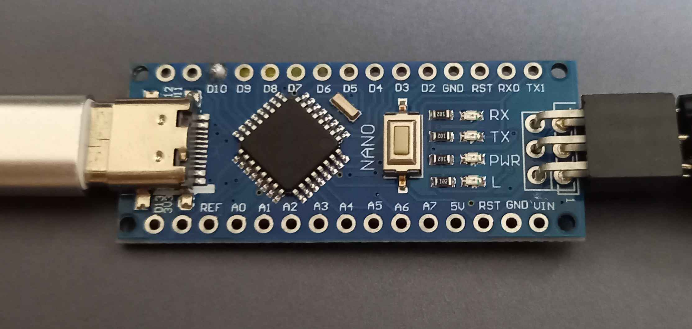
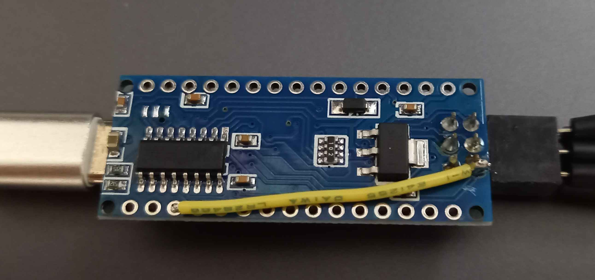

# AVR(attiny44a), Arduino as ISP, PlatformIO
## Arduino as ISP
Arduino Nanoの互換機を買ってきてISP用のピンのうちリセットピンとつながっているピンのパターン２本をカッター等で切断して変わりに銅線等でD10ピンとISPのピンのもともとリセットとつながっていたピンをつなぐ。
Arduino as ISPをNanoに書き込んで書き込み機は完成

## PlatformIO
このリポジトリのiniで動きます。
